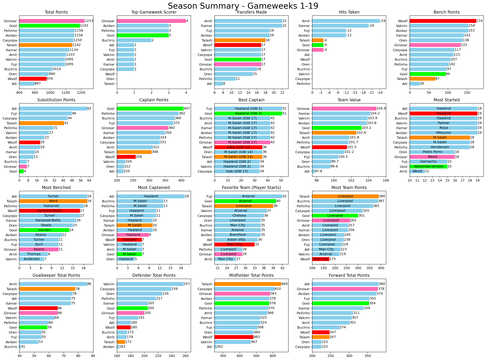
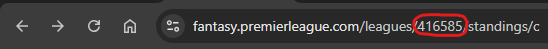

# FPL-Season-Summary
 
This is an FPL season summary for classic leagues between friends.

Compare your ranks and points, including transfers made, hits, bench points, captain points, favorite player and team, etc.



- **Total Points**
- **Top Gameweek Scorer** (number of GWs each manager scored the highest points)
- **Transfers Made**
- **Hits**
- **Bench Points**
- **Substitution Points**
- **Captain Points**
- **Best Captain**
- **Team Value**
- **Most Started** (which single player you played the most)
- **Most Benched** (which single player you benched the most)
- **Most Captained** (which single player you captained the most)
- **Favorite Team** (which team you played the most players from)
- **Team Points** (which team earned you the most points)
- **Total Points (GK)**
- **Total Points (DEF)**
- **Total Points (MID)**
- **Total Points (FWD)**

## Configuration
Set 'league_id' variable into your league's personal ID.
The league ID can be found within the fantasy website url under 'Leagues & Cups' after choosing your league

<p>⚠️ Tested on 14 managers league. Ideally use with up to 20 managers for best results</p>

## Advanced Options
### Managers Nickname
For cleaner visuals, you may supply a dictionary with manager ids as keys and nicknames as values.
For example, I used the following dictionary to create the visuals

`def get_team_name(id): return {4399125:"Avidan", 1606327:"Itamar", 262514:"Ginosar", 6697062:"Amit", 4047743:"Fuji", 957:"Gool", 247071:"Woolf", 2513453:"Talash", 2232819:"Vaknin", 4242417:"Buchris", 5859886:"Adi", 1256987:"Casyopa", 6621645:"Pellinho", 4081730:"Oren"}[id]`

### Highlight Managers
In case you want to highlight individual managers within the [Managers Comparison](#fpl-league-summary) plot,
you can supply a dictionary with manager ids as keys and colors as values.
For example, I used the following dictionary to create the visuals

`highlight_keys = {957: "lime", 262514: "hotpink", 247071: "red", 2513453: "darkorange"}`

## Output
### Text
```
** Summary: Mishtolelim in FPL - GW 19 **
Standings: (1) Ginosar (2) Gool (3) Pellinho
------------------------------
Most Highest GW Points: Ginosar (3 GWs)
Most Transfers: Amit & Itamar (22 Transfers)
Most Hits: Amit (6 Hits, -24 Points)
Most Bench Points: Woolf (174 Points)
Most Substitution Points: Adi (62 Points)
Most Captain Points: Gool (407 Points)
Best Captain: Gool (Haaland, 51 Points, GW 2) & Fuji (Haaland, 51 Points, GW 2)
Highest Team Value: Ginosar (104.9M £)
Lowest Team Value: Adi (97.8M £)
```

### Season Summary ([as shown above](#fpl-season-summary))
